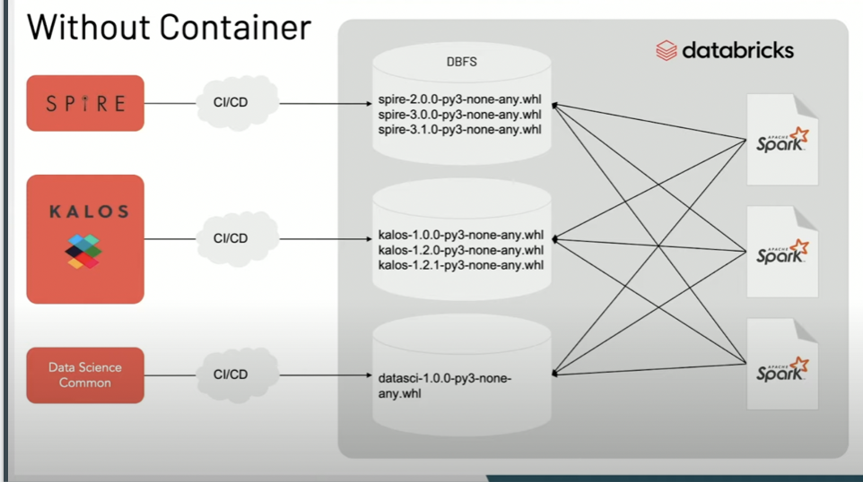
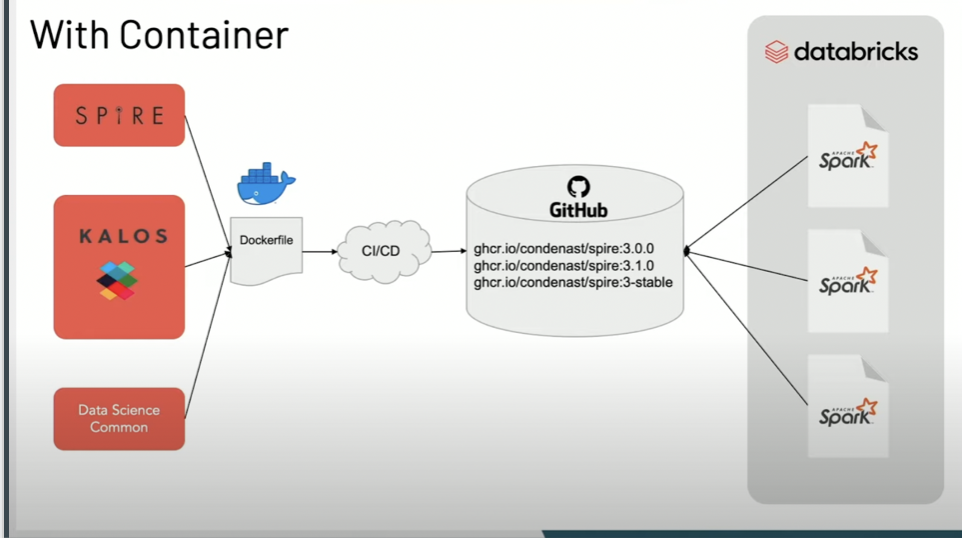

## Repository
https://github.com/densmoreb1/streamlitApp/

## Heroku
https://secure-coast-58551.herokuapp.com

### Using Databricks
I have learned a lot about how useful a platform like Databricks is useful. Data can be chaotic, hard to navigate, and control. Databricks creates an environment that makes it easy to explore and load data. They also use a language that is made to be fast and efficient when working with data. When working with big data, the spark API is incredibly useful. I hope to use Databricks when I start my career.

### Pandas vs Pyspark
Pandas is useful when dealing with small data. When commands are run in Pandas, they are not done concurrently. Pyspark is so useful when it comes to big data because it run concurrent operations. The work is split up. Pyspark can handle datasets much larger than what Pandas can handle.

Pyspark is like this truck, while Pandas is like the person standing next to it.

### Docker
Docker allows you to create containers for applications. A lot of the time, programs depend on other programs. Sometimes, those programs don't work with others. It can be hard finding the perfect match. Docker makes it easy for everyone to get the right programs they want and makes sure it works. 
People can create containers that others can download and run on their computer and it will work without the need to excessive debugging. When using Docker with programs like Databricks, it makes the pipeline a lot easier to manage. Instead of having to deal with broken updates, you can have one file to manage all the programs.

A disorganized and confusing diagram goes from this to this.

### Statistical Regression vs Machine Learning Regression
From what I have gathered, machine learning focuses on prediction rather than inference. Machine learning does not go off of assumptions. The models that are made to predict something only go off of the data it is given. Before applying a system of algorithms and seeing which is best, statistics requires choosing a model that lines up with our knowledge of the question at hand.